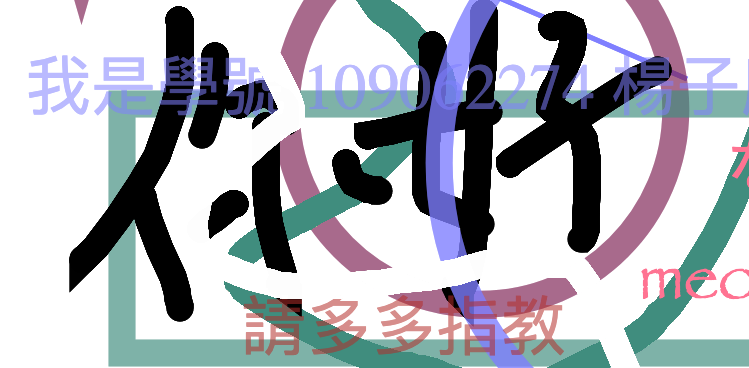
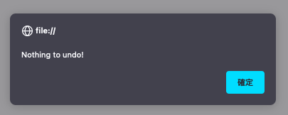
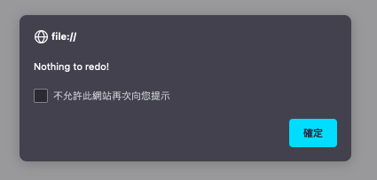
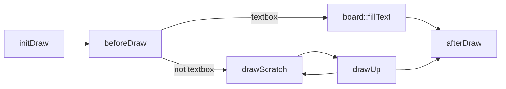
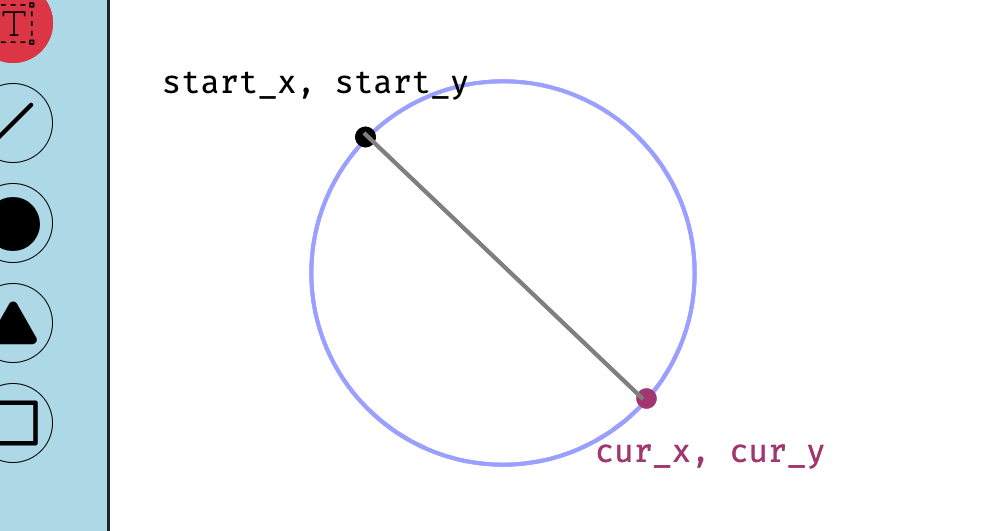

# Assignment 01 Web Canvas

> Course: Software Studio 2023 Spring
> 
> Author: < [`Shiritai`](https://github.com/Shiritai) > NTHU CS 109062274 楊子慶

## Scoring

| **Basic components** | **Score** | **Check** |
| :------------------- | :-------: | :-------: |
| Basic control tools  |    30%    |     Y     |
| Text input           |    10%    |     Y     |
| Cursor icon          |    10%    |     Y     |
| Refresh button       |    5%     |     Y     |

| **Advanced tools**     | **Score** | **Check** |
| :--------------------- | :-------: | :-------: |
| Different brush shapes |    15%    |     Y     |
| Un/Re-do button        |    10%    |     Y     |
| Image tool             |    5%     |     Y     |
| Download               |    5%     |     Y     |

| **Other useful widgets** | **Score** | **Check** |
| :----------------------- | :-------: | :-------: |
| Multiple Color Picker  |   1~5%    |  Y    |
| Separate Solid Mode    |   1~5%    |  Y    |
| Transparency Control    |   1~5%    |  Y    |

---

## How to use 

以下為使用的概覽，注意顏色選擇點兩下會從右邊浮現顏色設定面板，文字輸入也類似。

浮現出的設定面板如下圖。

## Web page link

> 以下兩者都行

* [https://ss-assignment1-16e1b.firebaseapp.com/](https://ss-assignment1-16e1b.firebaseapp.com/)
* [https://ss-assignment1-16e1b.web.app](https://ss-assignment1-16e1b.web.app)
* 
## Bonus Function description

### 多重顏色選擇器

常見的繪圖軟體通常會保留多個顏色選擇器，以供繪師快速建立自己的調色盤。故我以 DOM 實現多個顏色選擇器，共用同一個顏色設定頁面，並實現不同顏色選擇器的數值不互相干擾。

注意顏色的選擇明顯非使用 `<input type='color'>` 完成，而是使用 `<label>` 完成，其僅模擬按鈕的功能。

### 分離式填滿模式

自 Spec 的規定延伸，我將「填滿與否」分別實作於圓、三角、長方形，包含滑鼠圖標也會同時修改「填滿與否」。點擊兩下切換實、空心功能。

如上圖，單擊可選擇使用圓、三角或方形功能，與其他功能相同，被選擇的功能之按鈕會被標記為紅色。若在被標記的情況下再次點擊圓、三角或方形功能，便會切換顯示圖示，實心變空心、空心變實心。滑鼠的圖案亦與該圖示同步。

### 透明度控制

本繪圖網頁提供透明度的調整。該設定適用於所有可繪圖之物件，包含文字輸入。

### 還原 / 重做

若已經無可以還原 / 重做的步驟，會跳出提示

|no undo|no redo|
|:-:|:-:|
|||

## Brief Implementation description

### Framework

框架採用 Bootstrap + node.js + Firebase + TypeScript 完成。若檢閱 `.js` 檔可能會發現排版十分詭異，那是正常的，因為是由 TypeScript 編譯而成。關於框架的建置，可以參考旁邊的 [note.md](note.md) 檔案。

### Implementation of drawable tools

可繪製的物件包含以下:

* pencil: 筆
* eraser: 橡皮擦 (非以白色實作)
* textbox: 輸入文字
* line: 直線
* circle (void, solid): 實、空心圓
* triangle (void, solid): 實、空心三角型
* rectangle (void, solid): 實、空心長方形

以上物件的繪製流程如下:

> 請使用能讀取 mermaid 之 markdown 閱讀器閱讀。

上圖之 `board` 為 `canvas.getContext("2d")`，可見於可見於 `canvasSetup` 函式，其定義 `canvas` 受點擊後應該完成的行為。分別是

* `onmousedown`: `initDraw` 和 `beforeDraw`
* `onmousemove`: `drawScratch` 和 `drawUp`
* `onmouseup`: `drawUp` 和 `afterDraw`, 或針對文字輸入則為 `setTextInput`, 其會呼叫 `beforeDraw`, `board::fillText` 和 `afterDraw`。

可見本實作並沒有獨立針對某物件的函式，如此達到盡可能不撰寫多餘的程式碼，即相同的邏輯不用不斷重寫。以下我將針對不同工具，概述實現的核心方法。

* pencil

    於 `drawScratch` 中使用 `board::lineTo` 決定繪圖點，並在 `drawUp` 正式以 `board::stroke` 方法繪圖。

* eraser

    近乎等同 pencil，於 `drawScratch` 中使用 `board::lineTo` 決定繪圖點，並在 `drawUp` 正式以 `board::stroke` 方法繪圖。差別在設定 `board::globalCompositeOperation` 為 "destination-out" 以開啟清除模式。
* textbox

    較特別，非與打字同步的方式繪製，而是先建立一 `<input>` 蒐集文字輸入，之後刪除該 `<input>`，並將文字以 `board::fillText` 的方式繪製。注意由於此操作發生在按下 `Enter` 或游標移開輸入方格時，故應該在這兩種情況發生時呼叫 `beforeDraw`  和 `afterDraw`，對此我以 `check_and_destroy` 函子完成實作。

    另一特點是，textbox 若在畫布上滿滿都是，或者使用者點按的差池，本來都會導致產生多個懸空 `<input>`，使畫面變得很可怕。對此，我設計、實作並使用 `Mutex.Mutex` 物件，完成「建立 `<input>`」的互斥鎖邏輯。

以下四者我使用「暫存舊圖」的方式完成實作。由於滑鼠移動時應該動態調整繪製出的物件，本實作於開始移動前將畫面暫存，繪製時不斷倒退回移動前的畫面狀態，同時根據當前滑鼠位置繪製物件。具體描述如下。

* line

    直線的繪製為根據點擊時紀錄的座標 `start_x, start_y` 以及當前坐標 `cur_x, cur_y` 決定。前者決定起點 (`board::moveTo`)，後者決定終點 (`board::lineTo`)。

* circle (void, solid)

    圓形的繪製可參考下圖 (p.s. 正是以此繪圖網頁繪製而成)。

    

    由上圖，半徑可以用下式計算。

    $$
    radius =  \sqrt{\Big(\dfrac{cur\_x - start\_x}{2}\Big)^2 + \Big(\dfrac{cur\_y - start\_y}{2}\Big)^2}
    $$

    另外圓心的計算為以下。

    $$
    center = \dfrac{start + cur}{2}
    $$

    並以 `board::arc` 設定之，接著透過之前介紹的流程完成繪製。於 `drawUp` 繪製時，由 `tri_counter` 映射物件紀錄繪製實心與否的訊息來決定應該呼叫 `board::fill` 或者 `board::stroke` 方法。

* triangle (void, solid)

    三角形的輪廓設定與直線同理，只是座標稍作調整。而實心與否的控制也同圓形，以 `tri_counter`
 物件的紀錄決定繪製方法。

* rectangle (void, solid)

    使用 `board::rect` 方法生成方形輪廓，之後與三角形和圓形同理。

### Implementation of functional tools

包含 undo, redo, reset, download 和 upload。

為了實現繪製內容的歷史紀錄，我以動態陣列 `Array<ImageData>` 為基礎，實現一類似 stack 的資料結構，其有 `undo`、`redo` 和 `reset` 方法，正是對應 Spec 中的三個功能的背後邏輯。

使用上對應的物件是 `Screenshot`，以 `screenshot` 全域變數存取之。其功能如其名：擷取當前的畫布。故每當一物件被成功繪製，就應該呼叫其另一方法 `shot`。為了避免重複撰寫此邏輯，我將此方法的呼叫包裹在 `afterDraw` 函式內。

以下簡介做法:

* undo

    若可以，降低 stack top `Screenshot::cur` 並更新 `board`，讓接下來存取之物件為前一筆的資料。
    
* redo

    若可以，提升 stack top `Screenshot::cur` 並更新 `board`，讓接下來存取之物件為後一筆的資料。

* reset

    初始化所有物件，並將當前空白畫面截圖。

如此一來，undo, redo 和 reset 的實作就僅剩一步之遙，細節省略。

### Implementation of supporting tools

包含滑鼠設定、筆刷大小、透明度、顏色選擇器、文字設定和 offcanvas。

* 滑鼠的設定

    切換 html element 的 `class` 搭配 `css` 來完成。這種做法有助於降低讀取檔案的性能開銷。在設定為某一圖標前，將舊的圖標對應之 `class` 全數清除，以 `resetCanvasMouseIcon` 函式實作。其中圓、三角和方形的切換透過前面提到的 `tri_counter` 這個映射與當前狀態兩者合力完成，可見於 `setOnclickEvent` 函式。

* 筆刷大小、透明度、顏色選擇器

    這三者有異曲同工之妙，都透過讀取前端滑桿所擁有的 `HTMLInputElement::value` 成員來獲得所求值。另注意到這些變化會實時反映到該滑桿旁的 label 上，這是透過設定 `onmousemove` 和 `onmouseup` 完成。

* 文字設定

    採用 `<select>` 搭配 `board::font` 於 beforeDraw` 時設置完成。

* Offcanvas

    為 Bootstrap 5 的新元素，能顯示側邊欄與對應元素。我以此為基礎，左為顏色設定，右為字型設定。依照[官網](https://getbootstrap.com/docs/5.3/components/offcanvas/)，側邊欄的顯示與否為調整 Offcanvas 之 `class` 完成，故我設計 `offcanvas_move` 輔助函式，搭配當前狀態的紀錄，完成其顯示與隱藏的功能。

### Others (Optional)

本 Lab 中熟悉 JavaScript/TypeScript 的各式進階語法、DOM 的操作，並應用資料結構與作業系統所學的知識，在滿足許多功能的情況下維持程式碼易讀好懂的架構，確實獲益良多，不過處理 edge case，思考、設計並實作解決辦法還真是費時...

另外，為避免助教閱讀本檔案出現任何問題，另外預備一 PDF 以供參考。

